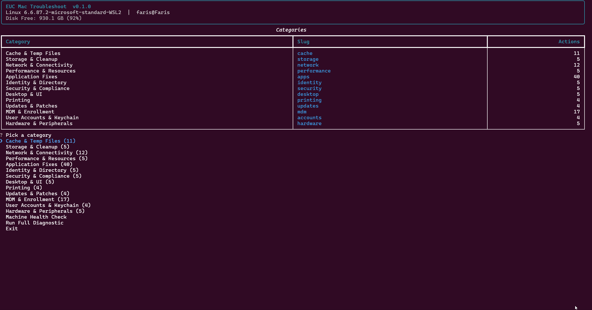

# EUC Doctor

A macOS-first CLI toolkit for support engineers and EUC (End User Computing) teams. It combines read-only diagnostics, high-signal explainers, and opt-in fixes for common Mac issues, organized into support-friendly categories.

## Demo

<p align="center">
  
</p>

## Features

- **Categorized diagnostics** — network, storage, performance, desktop, identity, MDM, cache, security, printing, hardware, accounts, and software updates
- **App support modules** — Teams, Outlook, Slack, Zoom, Chrome, Safari, Firefox, OneDrive, Adobe CC, VS Code, Dropbox, Cisco AnyConnect, and Jamf Connect
- **Safe by default** — read-only `INFO` and `DIAGNOSE` actions run without side effects; `FIX` actions require explicit confirmation
- **Dry-run support** — preview what a fix would touch before committing with `--dry-run`
- **Structured output** — every action returns structured data for terminal rendering and export to Markdown or JSON
- **Health check bundle** — a curated `health` command runs a machine-wide diagnostic sweep
- **Action history** — all runs are logged to `~/.euc-doctor/history/`
- **Jamf MDM coverage** — binary health, server connectivity, framework presence, and authchanger state

## Requirements

- Python 3.10+
- macOS (diagnostics target macOS APIs and paths)

## Installation

### One-command macOS bootstrap

```bash
bash <(curl -fsSL https://raw.githubusercontent.com/faris-tech-lab/euc-doctor/main/scripts/bootstrap_macos.sh) \
  --repo https://github.com/faris-tech-lab/euc-doctor.git
```

This will check prerequisites, clone the repo, create a virtual environment, install dependencies, and launch the toolkit.

### Manual install

```bash
git clone https://github.com/faris-tech-lab/euc-doctor.git
cd euc-doctor
python3 -m venv .venv
source .venv/bin/activate
pip install -e .
```

### Windows (development only)

The toolkit targets macOS for diagnostics, but you can explore the CLI on Windows:

```powershell
pip install -e .
.\euc-doctor.cmd
# or
.\euc-doctor.ps1
```

## Usage

```bash
# List all available categories and actions
euc-doctor list

# Run diagnostics across all categories
euc-doctor diagnose

# Run diagnostics for a specific category
euc-doctor diagnose --category network

# Run a machine-wide health check
euc-doctor health

# Run all actions in a category
euc-doctor run cache

# Dry-run a specific action to preview changes
euc-doctor run cache.teams --dry-run

# Generate a Markdown report
euc-doctor report --format markdown --output report.md

# View action history
euc-doctor history
```

## Project Structure

```
euc-doctor/
├── euc_doctor.py           # Top-level entry point
├── euc_doctor/
│   ├── cli.py              # Typer CLI commands
│   ├── registry.py         # Action registry (category/action mapping)
│   ├── health.py           # Health check bundle
│   ├── models.py           # Structured result models
│   ├── display.py          # Rich terminal rendering
│   ├── interactive.py      # Interactive prompts (InquirerPy)
│   ├── utils.py            # Shared utilities
│   ├── categories/         # Diagnostic category modules
│   │   ├── network.py
│   │   ├── storage.py
│   │   ├── mdm.py
│   │   └── ...             # accounts, cache, desktop, hardware,
│   │                       # identity, performance, printing,
│   │                       # security, updates
│   ├── app_modules/        # Per-app support modules
│   │   ├── teams.py
│   │   ├── outlook.py
│   │   ├── slack.py
│   │   └── ...             # zoom, chrome, safari, firefox,
│   │                       # onedrive, adobe_cc, vscode,
│   │                       # dropbox, anyconnect, jamf_connect
│   └── formatters/         # Output formatters (JSON, Markdown)
├── scripts/
│   └── bootstrap_macos.sh  # One-command macOS installer
└── tests/
    └── test_registry.py
```

## Design Principles

1. **Read-only first** — diagnostics should work without surprising side effects.
2. **Narrow fixes** — fix actions are explicit, scoped, and previewable.
3. **Structured data** — every action returns structured results for rendering and export.
4. **Progressive disclosure** — fragile or org-specific workflows stay as `INFO`/`DIAGNOSE` until well modeled.
5. **Support engineering value** — prioritize real diagnostic utility over command count.

## Contributing

Contributions are welcome! To get started:

1. Fork the repository
2. Create a feature branch (`git checkout -b feature/my-feature`)
3. Make your changes
4. Run tests: `python -m pytest`
5. Submit a pull request

## License

This project is licensed under the MIT License. See [LICENSE](LICENSE) for details.
